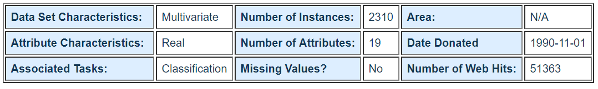

# Data Analysis

In this repo, you can find my first datascience projet, combining web-scrapping, data-visualization, data-preparation and modelisation. I did it for the Data Analysis lesson in 5th year at ESILV Engineering School.

## Statlog Image Segmentation Dataset

I used the dataset available at this adress :
[https://archive.ics.uci.edu/ml/datasets/Statlog+%28Image+Segmentation%29]()

The instances were drawn randomly from a database of 7 outdoor 
images.  The images were handsegmented to create a classification
for every pixel.  

Each instance is a 3x3 region.

Attribute Information:

    1.  region-centroid-col:  the column of the center pixel of the region.
    2.  region-centroid-row:  the row of the center pixel of the region.
    3.  region-pixel-count:  the number of pixels in a region = 9.
    4.  short-line-density-5:  the results of a line extractoin algorithm that 
         counts how many lines of length 5 (any orientation) with
         low contrast, less than or equal to 5, go through the region.
    5.  short-line-density-2:  same as short-line-density-5 but counts lines
         of high contrast, greater than 5.
    6.  vedge-mean:  measure the contrast of horizontally
         adjacent pixels in the region.  There are 6, the mean and 
         standard deviation are given.  This attribute is used as
        a vertical edge detector.
    7.  vegde-sd:  (see 6)
    8.  hedge-mean:  measures the contrast of vertically adjacent
          pixels. Used for horizontal line detection. 
    9.  hedge-sd: (see 8).
    10. intensity-mean:  the average over the region of (R + G + B)/3
    11. rawred-mean: the average over the region of the R value.
    12. rawblue-mean: the average over the region of the B value.
    13. rawgreen-mean: the average over the region of the G value.
    14. exred-mean: measure the excess red:  (2R - (G + B))
    15. exblue-mean: measure the excess blue:  (2B - (G + R))
    16. exgreen-mean: measure the excess green:  (2G - (R + B))
    17. value-mean:  3-d nonlinear transformation
         of RGB. (Algorithm can be found in Foley and VanDam, Fundamentals
         of Interactive Computer Graphics)
    18. saturatoin-mean:  (see 17)
    19. hue-mean:  (see 17)

8. Missing Attribute Values: None

9. Class Distribution: 

   Classes: 1 = brickface, 
	    2 = sky, 
	    3 = foliage, 
	    4 = cement, 
	    5 = window, 
	    6 = path, 
	    7 = grass.

## Usage

This project use a `ipython notebook`. You can launch an Anaconda instance to execute it. 

Using a package manager, you'll need to install `bokeh`, `matplotlib` and `scikit learn` to be able to execute the whole project.

## Data Viz

Using Bokeh library, I tried to show how we can classify each instance in a category from this list :
1. Brickface
2. Sky
3. Foliage
4. Cement
5. Window
6. Path
7. Grass

With the graphs, we can see that there is some attributes with the same values (more or less). For example, the region coming from Sky pictures have more important intensity than the others.

## Data modelisation

Using Scikit Learn library, I tried to predict the kind of picture which a 3x3 pixels region is coming from, using different kind of algorithms. 

It's finally the `Extra-Trees Regressor` algorithm which is the best for this dataset. It obtains a score of 0.99 to predict the classification of the data.

## License
This project isn't under any license. 